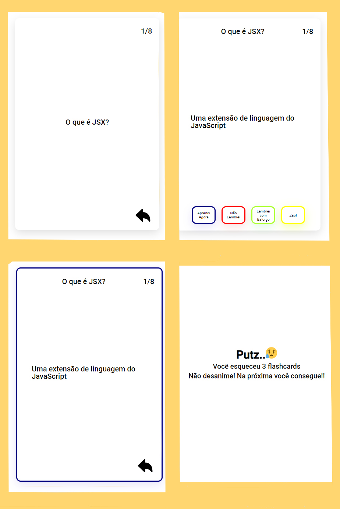

## ZapIt: Aprendendo Por Repetição

<figure align:"center">

</figure>

## Qual a lógica?

A ideia é ter um aplicativo que funcione como um bloco de cartões de estudo, ou flahs cards, baseados na técnica de repetição espaçada aplicada na memorização de conteúdos.

Atualmente, o aplicativo permite ao usuário:

- Ver a frente e o verso dos cards pré-estabelecidos, com navegação por cliques.
- Marcar o quão fácil foi de lembrar a resposta para a pergunta específica
- Ver, ao final do conjunto de cartas, quantas cartas ele esqueceu

<figure align:"center">

</figure>

## Como Usar?

A forma mais direta é ir direto no link:
<a>https://app-zap-recall-cartoes-de-estudo-hxwon4y4x-thaisfrancag.vercel.app/</a>

Mas, se quiser ver melhor as funcionalidade e o código em si, você também pode baixar o repositório para sua máquina, através dos seguintes passos:

1. Clone o repositório
   (se não souber como, confira: https://docs.github.com/pt/repositories/creating-and-managing-repositories/cloning-a-repository)

2. Instale as dependências necessárias (no caso, digitar "npm install" na pasta onde clonou o repositório deverá ser suficiente)

3. Depois de instaladas, basta digitar "npm start" no terminal, e o aplicativo será iniciado no seu navegador!

4. Com o aplicativo iniciado, é só iniciar no botão "praticar react". O primeiro cartào será exibido, e ai basta ir clicando nos botões do cartão para avançar no baralho

5. Ao final, se quiser passar novamente pelo baralho, basta atualizar a página que a aplicação será reiniciada.

## E como ele foi feito?

O aplicativo TrackIt foi criado usando:

- [React-Native](https://facebook.github.io/react-native/)

- [Prettier](https://prettier.io/)

## Projetos Futuros?

O projeto ainda tem alguns ajustes a serem feitos no futuro, a fim de melhorar a usabilidade e a experiência do usuário. Inclusive, se tiver sugestões, elas serão mais do que bem-vindas!
Atualmente, as atualizações planejadas são:

- Permitir que o usuário repasse pelo baralho na tela final sem ser necessário atualizar a página
- Permitir que o usuário crie baralhos personalizados
- Permitir a existência de mais um de baralho disponível
- Armazenar os resultados do usuário
